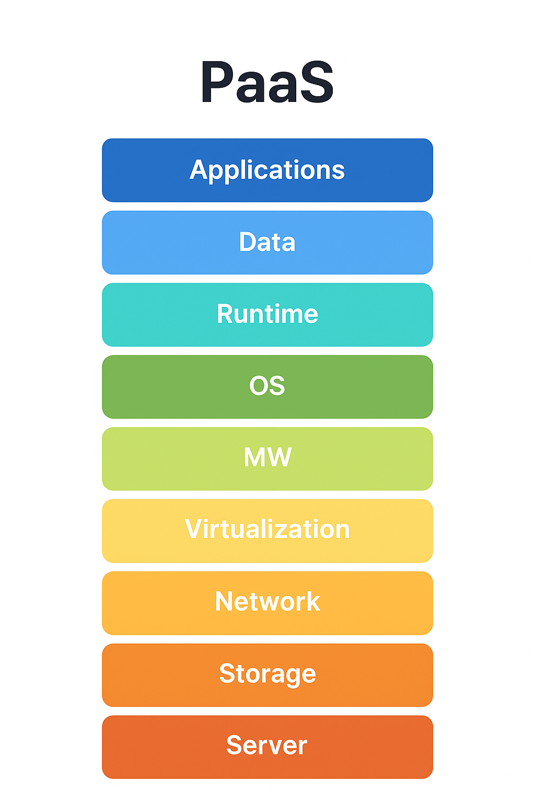

# PaaS - Platform As A Service

## Abstract

PaaS is a third-party cloud computing model that provides developers with the complete platform to build, deploy and managing applications without managing the underlying infrastructure. It simplifies the application development. PaaS reduces the operational complexity, and accelerates time-to-market. PaaS takes care of all the thingd like servers, storage, and networking allowing developers to focus mainly on writing the code and delivering applications quickly. This paper discuss the concept, architecture, benefits, use cases, and challenges of PaaS.

---

## Introduction:

Cloud Computing transfers how organisations deploy and develop. Among its services, PaaS acts as a middle layer between Infrastructure as a Service (IaaS) and Software as a Service (SaaS). Unlike IaaS, provide the fundamental infrastructure like storage and servers, and SaaS provides ready-made software/applications, PaaS provides complete environment for developers with necessary tools and to create custom applications from scratch. 

---

## Definition & Architecture:

PaaS delivers a cloud-based platform that includes the underlying infrastructure (hardware, networking, storage) managed by providers, and the platform layer for developement, which features an OS, middleware, runtime environments, and development tools. Developers can deploy their applications directly on the platform without worrying about server maintenance, network configuration, or storage management. Common PaaS platforms include Microsoft Azure App Services, Google App Engine and Heroku. 

 
Architecture of PaaS

---

## Features & Benefits:

PaaS offers several advantages for organizations and developers. It provides a complete cloud-based development environment with pre-configured infrastructure, middleware, and integrated tools for building, testing and deploying applications. It supports multiple programming languages, automatic scaling, cost efficient, security, and maintenance, allowing developers to focus on coding rather than managing hardware or software. Additionally, PaaS supports collaborative development, enabling teams to work simultaneously from different locations. The platform also enables faster development, flexibility, collaboration, and reliability, making it easier for teams to innovate and deploy applications seamlessly.

## Use Cases:

PaaS is widely used for Mobile and Web Application development, API development, Database Management, IoT Applications, Collaborative Developement and the microservices deployment. Nowadays, Startups often adopt PaaS to rapidly prototype applications without heavy upfront investments.

---

## Challenges:

Despite its benefits, PaaS has some limitations:

* ### Limited Customization:
    - It offers many built-in tools, but they're not always flexible.

* ### Performance Limits:
    - It provides often set limits on resources like memory, CPU, and storage.

* ### Downtime and Reliability:
    - Dependence on provider's uptime; outages can impact applications.

* ### Cost Management:
    - Scaling and resource usage can lead to unexpected costs if not montiored carefully.

---

## References

1. ChatGPT (OpenAI) – Information and explanation on PaaS.  
2. GeeksforGeeks – Articles and tutorials on cloud computing and PaaS.  
3. YouTube: [PaaS Explained](https://youtu.be/QAbqJzd0PEE?si=kaPH0pv567lDnrtv)  
4. YouTube: [PaaS Overview](https://youtu.be/lsvpvCU6Oxs?si=R8gpvVuJe39HatpH)